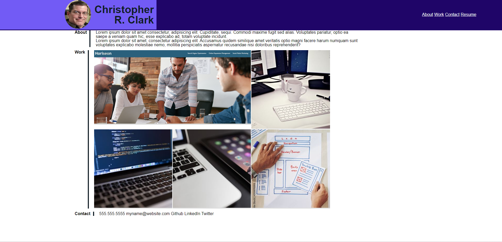

# Portfolio

The goal of this assignment was to create a portfolio page using html and css, in which we could add our course progress. This portfolio of work can be used to showcase our skills and talents to future employers.

Here is a link to the final version of the project: 

[Click here to see my Portfolio.](https://christopherrclark.github.io/portfolio/)

